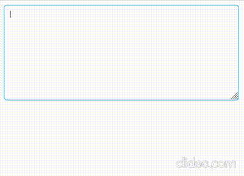

# Mentionable Input

This project aims to showcase how to create a mentionable (taggable) textarea while also highlighting the nuances and complexities.

## Usage
```jsx
const usersAvailable = useMemo(() => [
    { id: 'foo', fullname: 'Foo Bar' },
    { id: 'baz', fullname: 'Foo Baz' }
  ],
  []
)
<MentionableInput users={usersAvailable} />
```

## Complexities

- Maintaining and updating 2 different values
  - Raw value: Value that consists of mentions and metadatas. This value is not visible to users.
  - Visible value: Derived from the raw value but in a user friendly way.
  - <strong>Challenge:</strong> Remember the user interacts with the visible value, which needs to be properly translated into the actual raw value.
    - Analogy: Think of it like working with lossy compression. Once you compress an image using lossy compression, some information is lost. Reversing the process to retrieve the original image is tricky (or rather impossible). <strong>Similarly, translating user edits from the visible value back to the raw value can be complex and challenging.</strong>
- HTML textareas do not support different formatting for small pieces of text, neither are they interactable (clickable, hoverable)
  - You would surely want mentions to be in a different color or formating.
  - You would also probably want users to be able to click or interact with those mentions.
- Finding the exact position of the "@" symbol in order to provide the user with a neat dropdown with the list of available mentionable users.

## Example in action



## Additional links

Demo: https://mention-input-react.vercel.app/

Unit tests:
- [src/MentionableInput/index.spec.tsx](https://github.com/giriss/mention-input-react/blob/main/src/MentionableInput/index.spec.tsx)
- [src/MentionableInput/utils/index.spec.ts](https://github.com/giriss/mention-input-react/blob/main/src/MentionableInput/utils/index.spec.ts)
