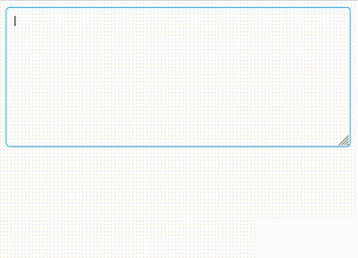

# Mentionable Input

This project aims to showcase how to create a mentionable (taggable) textarea while also highlighting the nuances and complexities.

## Usage
```jsx
const usersAvailable = useMemo(() => [
    { id: 'foo', fullname: 'Foo Bar' },
    { id: 'baz', fullname: 'Foo Baz' }
  ],
  []
)
<MentionableInput users={usersAvailable} />
```

## Complexities

Also documented [here](https://blog.gopaul.me/challenges-faced-when-developing-textarea-mention-feature/) on my blog 🙂


## Example in action



## Additional links

Demo: https://mention-input-react.vercel.app/

Unit tests:
- [src/MentionableInput/index.spec.tsx](https://github.com/giriss/mention-input-react/blob/main/src/MentionableInput/index.spec.tsx)
- [src/MentionableInput/utils/index.spec.ts](https://github.com/giriss/mention-input-react/blob/main/src/MentionableInput/utils/index.spec.ts)

Other cool works by me:
- [Portfolio](https://girish.gopaul.me)
